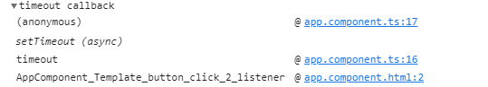

After add `zone.js` ,`rxjs` and some `angular` framework js to the chrome dev tools ignore list,
the `async stack tagging` console trace looks like this.

- timeout

- promise

- button click

- Http Request

